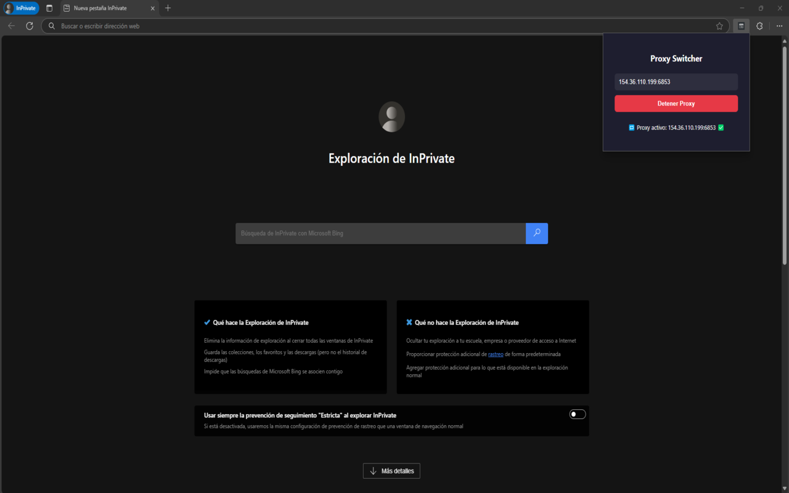
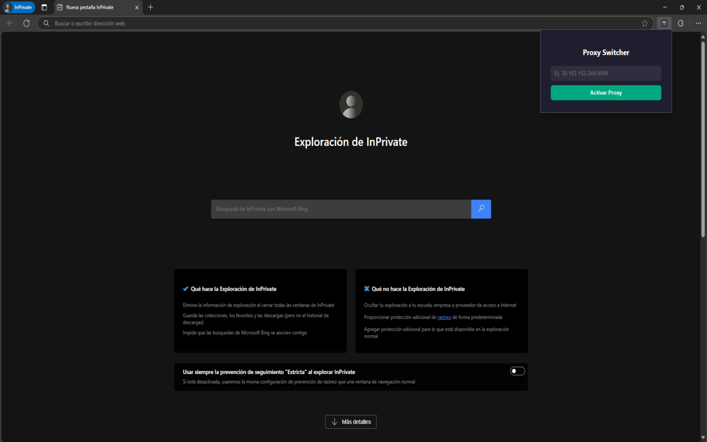

# 🔐 Proxy Switcher Extension for Chrome & Edge

A simple and elegant browser extension that allows you to activate or deactivate a custom HTTP proxy with a single click.

---

## 🛠 Features
- One-click proxy activation
- Proxy status indicator (Active/Inactive)
- Clean and modern design
- Compatible with Chrome and Edge

---

## 📸 Screenshots

| Proxy Activated | Proxy Deactivated |
|------------------|-------------------|
|  |  |

---

## ❓ How to Use

1. Click on the extension icon.
2. Enter your proxy in the format: `IP:PORT`.
3. Click "Activate Proxy" to start using it.
4. Click "Stop Proxy" to disable it.

---

## 📬 Support

Need help? Have feedback or suggestions?

→ Open an issue here: [GitHub Issues](https://github.com/Prenda00/proxy-extension/issues)

Or contact: `soporte@tudominio.com` *(replace with your email)*

---

## ⚠️ Disclaimer

This extension does not store or share any data. You are responsible for the proxies you use.
